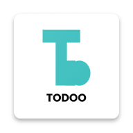

# TODOO (TAHAP PENGEMBANGAN)

Ini adalah aplikasi todo list.

Note : Aplikasi ini dibuat untuk pembelajaran, untuk desain aplikasi saya dapat dari guru saya dan saya tidak tahu guru saya dapat dari mana.

Desain Figma : [Todoo list App](https://www.figma.com/file/wxPw2qvpKPxlFPOsgUY5So/A-Todo-list-App-(Community)?type=design&node-id=0%3A1&mode=design&t=R5qVJSyHKExCjvqz-1)

## Teknologi Yang Digunakan Di Frontend
- Desain ( Figma )
- Icon Aplikasi ( Icon kitchen )
- Dart ( Bahasa Pemograman )
- Flutter ( Framework Android )
- Getx ( Design pattern )

## Package Yang Digunakan Di Flutter
- Getx ( State Management )

## Teknologi Yang Digunakan Di Backend
- Belum Ada

## CHANGELOG
- [Lihat disini](CHANGELOG.md)